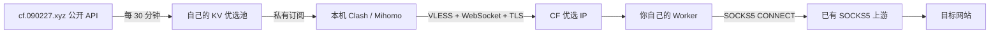

# Cloudflare SOCKS5

让本机 **Clash/Mihomo → Cloudflare 优选入口 → 已有 SOCKS5 → 目标网站**。

你只需在 Clash 中导入订阅。自己的 Cloudflare Worker 负责转接，出口仍是原来的 SOCKS5；不需要安装 3x-ui，不依赖 Private XUI，也不需要另一台 VPS。

> 优选改变的是到达上游的线路，不能修复 SOCKS5 服务器本身的拥堵。先对比实测再决定是否使用。第一版支持 TCP，明确不支持 UDP、QUIC 或游戏 UDP。

## 快速开始

准备好 **Node.js 22+、Git、自己的 Cloudflare 域名和已有 SOCKS5**。

在电脑终端复制运行：

```bash
git clone https://github.com/isyundong/cloudflare-socks5.git && cd cloudflare-socks5
npm ci
npm start
```

然后跟着向导填 **域名、SOCKS5 地址、端口、用户名和密码**。连接方式会自动检测，通常无需选择 TLS。只有无法确认时才询问，回车可退出。

确认后，程序会打开 Cloudflare 登录页面（已登录则跳过），自动创建优选存储、绑定域名、部署并上传凭据。多个账户时选择域名所在账户即可，**不用自己填写 KV ID 或执行上传密钥命令**。

完成后，复制终端显示的订阅地址，导入 **Mihomo 内核的 Clash**，选择 **PROXY → 自动优选**。地址也保存在 `subscription.local.txt`。本机默认混合代理端口是 `7890`，部分图形客户端会使用自己的端口设置。

检测只发送 SOCKS5 握手，不发送账号密码；优先验证 TLS 及证书，再探测普通 SOCKS5。检测从本机发起，不能代替 Worker 到上游的可达性和账号密码验证。已有配置会保留原连接方式。

中途失败，重新运行 `npm start` 即可继续；已有配置和凭据会复用。域名证书和定时任务首次生效可能需要等待。

本地 `secrets.local.json` 保存节点凭据和填写的上游账号密码，设置为仅当前用户可读写并被 Git 忽略；请勿分享该文件或订阅链接。Cloudflare 登录由 Wrangler 管理，不需要把 API Token 填进本项目。

## 自动更新

| 内容 | 行为 |
| --- | --- |
| 公开优选 IP 池 | Worker 每 30 分钟请求三家运营商接口，保存至自己的 KV |
| Clash 节点列表 | Mihomo 的 proxy-provider 每 30 分钟更新，无需反复重导完整配置 |
| 本机线路检测 | 每 5 分钟通过完整代理线路测延迟；80ms 容差减少频繁切换 |
| 优选域名的 IP | 保留域名，由客户端 DNS 按 TTL 重新解析；由域名维护者更新 DNS |
| 接口失败 | 按运营商保留最近成功列表，最长使用 7 天；始终有自有域名备用入口 |

来源：[cf.090227.xyz API](https://cf.090227.xyz/#/api)，使用 `/ct?ips=12`、`/cu?ips=12`、`/cmcc?ips=12`，无需来源 API 密钥。只接受 Cloudflare 官方 IPv4 网段，去重后数量可能较少，不采用接口混入的其他中转 IP。公开来源认为的优选不等于你本地实测最佳。

这是两层更新：Worker 更新池，客户端再获取；最坏情况下会经历两个刷新周期，KV 传播和网络故障也会影响时效。电脑关闭或客户端未运行时，不会做本机测速。入口切换影响新连接，现有连接不会迁移；连接本身断开仍需应用重连。

## 原理与边界



Clash 的节点类型显示为 **VLESS**，因为 Clash 到 Worker 需要可经 HTTPS 传输的协议。Worker 在内部使用 SOCKS5 连接你的上游；目标网站看到的出口仍由上游决定。CF IP 本身不是可以直接填写账号密码的 SOCKS5 服务器。

- Cloudflare 禁止 Worker TCP 连接到 CF 自身 IP、内网和 localhost。上游应使用真实公网地址或 DNS-only 域名，不能用橙云域名；上游若仅允许你家 IP，也需要调整访问限制。Worker TCP 出口并不属于常见的 CDN 回源网段。
- 普通 SOCKS5 不加密 Worker 到上游这一段，账号密码也在这一段明文传输。只有上游明确提供 SOCKS over TLS 时，才把 `UPSTREAM_TLS` 设为 `true`；启用后验证证书。HTTPS 网站自身仍有应用层 TLS。
- 本项目只连接固定上游，不会在上游失败时改用 Worker 直连目标网站。允许的业务 TCP 流量路由到 PROXY，普通 UDP 和捕获的 IPv6 目标流量被拒绝；订阅下载本身通过自有域名直接请求，避免启动时循环依赖。
- UUID 是节点访问凭据；订阅链接能获取 UUID。两者都应保密，泄露时分别更换 `UUID`、`SUB_TOKEN`，重新生成客户端订阅 URL 并导入。仅换订阅令牌不能撤销已获得的 UUID。
- 上游账号密码只放 Worker Secrets。关闭应用日志采集；但 Cloudflare 平台仍可能保留其基础设施日志。取数请求不携带 UUID、订阅令牌或上游账号密码，Cloudflare 可添加 `CF-Worker` 等来源元数据。
- TCP 转 WebSocket 有额外开销，没有 UDP/半关闭保证；上传等待队列上限 1 MiB，超限断开，不无限排队。高并发和大流量需要实测，并受 Cloudflare 当前套餐限制。

## 更新和排查

更新代码：`git pull`、`npm ci`、`npm run deploy`。不会自动旋转 Secrets；更新时保留本地配置。

把订阅地址末尾 `Cloudflare-SOCKS5.yaml` 改成 `status`，可以查看各运营商数量和最近成功更新时间，**不要公开这个带令牌的 URL**。无 KV 时只能给域名入口；重新检查 `wrangler.local.jsonc` 的 `kv_namespaces`。

Clash 的主配置通过 `proxy-providers` 引用节点，因此主文件里的 `proxies` 只有一条备用配置；全部优选节点在客户端的 **CF入口** 代理集合中。手动更新这个集合即可立即获取 Worker 当前的池。

如所有线路都失败，依次核对：Worker 域名证书、UUID、SOCKS5 公网可达性、账号密码、上游白名单。若线路都可用但仍卡，比较同一时段直连 SOCKS5 与 CF 转接的延迟和下载表现，可能是上游拥堵或 CF 路线并不适合你的网络。

## 开发验证

```bash
npm test
npm run check
# 可选：使用自己安装的 Mihomo 进行本地端到端测试
node tools/smoke-mihomo.mjs /absolute/path/to/mihomo
```

测试包含 VLESS 分包、SOCKS5 认证失败、顺序转发、公开来源过滤、订阅与凭据隔离，以及 workerd 运行时连接本地 SOCKS5 测试服务器的真实 TCP 往返。`check` 只打包，不部署。开发中的端到端测试使用虚构凭据，不代表你的公网链路已验证。

协议依据：[Xray VLESS](https://github.com/XTLS/Xray-core/blob/main/proxy/vless/encoding/encoding.go)、[RFC 1928](https://www.rfc-editor.org/rfc/rfc1928)、[RFC 1929](https://www.rfc-editor.org/rfc/rfc1929)、[Worker TCP sockets](https://developers.cloudflare.com/workers/runtime-apis/tcp-sockets/)、[Mihomo proxy-providers](https://wiki.metacubex.one/config/proxy-providers/)。

## 客户端 TUN 与 DNS

完整订阅已包含偏隐私的 TUN、DNS 和路由配置：网站 DNS 经代理加密查询，捕获的 IPv6 目标流量和非 DNS 的普通 UDP 被拒绝，可能影响视频通话、游戏和 QUIC。Clash Verge Rev 仍需启用 TUN 并检查配置覆盖；Linux Mihomo 需要对应权限。更新时刷新完整配置，不能只更新节点。详见 [多设备设置与保护边界](docs/privacy.md)。
